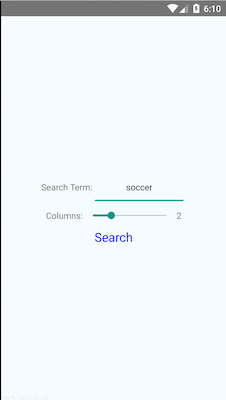

Search Images Test Project
===

Basic requirements
---

The app should:

* Preferably be built with [React Native](https://facebook.github.io/react-native/), preferably latest version. Implementation using native Android/iOS technologies is fine too.
* Consist of 2 screens:
	* Search screen which allows user to specify search terms and number of columns (max 5) for displaying the resulting images. This screen should be showing when the app opens.
	* Display screen which will display the images from the result of the search.
*  Images should be displayed in "grid"-like view with number of columns specified in search screen.
* Allow to return from Display screen to Search screen.
* Show some kind of loading screen while it queries Google/Bing/DuckDuckGo (or any other search engine/API of your choice).
* Run both on Android and iOS.

Bonus/Additional features
---

Not essential, but nice to have:

* Persist search state between app openings. Also show loading screen while data is fetched from internal memory.
* Support Android back button press.
* Show some kind of progress bar on images while they are loading.
* Validating that all image links are actually correct (to avoid showing empty squares).
* Some styling.

Some hints/clarifications
---

* It's okay (and might be easier )to simply send GET request to Google/Bing/DuckDuckGo and parse HTML, when searching for images, instead of using the corresponding Image Search API.
* It's good (and encouraged) to use any `npm` packages you can find/think of.
* If something is unclear or you have any additional questions, don't hesitate to submit an issue with your question.
